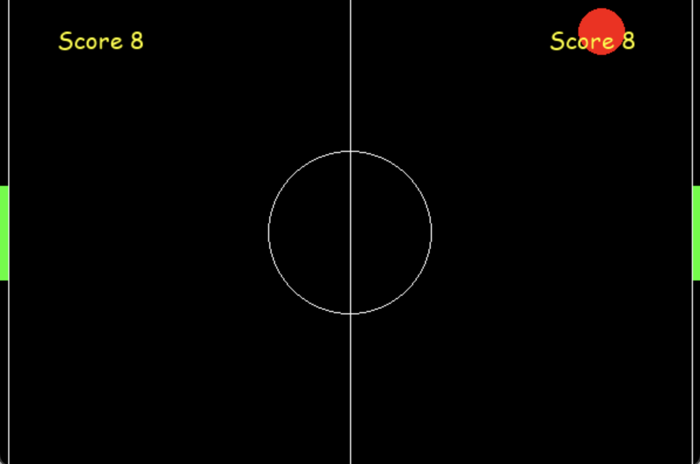

# Ping Pong! 🎮🏓  


## Classic Ping Pong Game - Multiplayer Fun! 🎉  
**Ping Pong!** is a classic two-player arcade game where you control paddles to compete against a friend. With simple mechanics and engaging gameplay, it's the perfect way to test your reflexes and enjoy some friendly competition.  

### Key Features:  
1. **Two-Player Mode**: Play against a friend and aim for the highest score 🎮  
2. **Responsive Controls**: Smooth paddle movement for precise gameplay ⌨️  
3. **Dynamic Ball Physics**: The ball speeds up with each bounce for added excitement ⚡  
4. **Real-Time Scoring**: Track your progress with an on-screen scoreboard 📊  
5. **Customizable Settings**: Modify paddle size, ball speed, and game visuals 🎨  

### Technology Used:  
- **Python** for game logic and mechanics 🐍  
- **Pygame** for rendering graphics and handling user interactions 🎮  

### How to Run:  
1. Clone the repository to your local machine:  
   ```bash  
   git clone https://github.com/YuYeon-K/ping-pong.git  
   cd ping-pong  
2. Run the game:
   ```
   python3 pong_game.py
